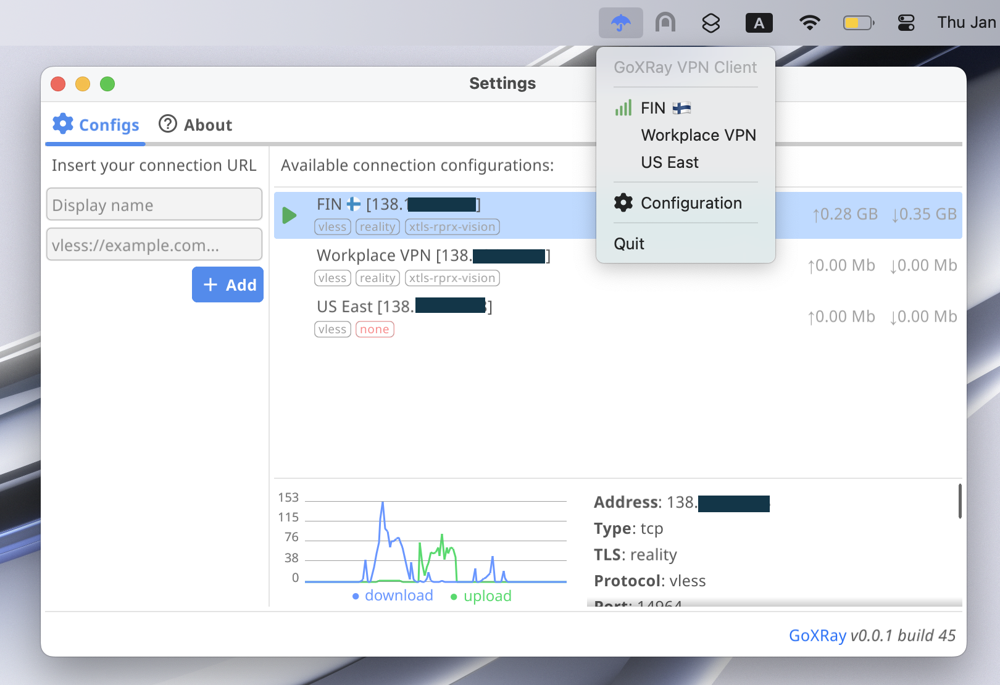
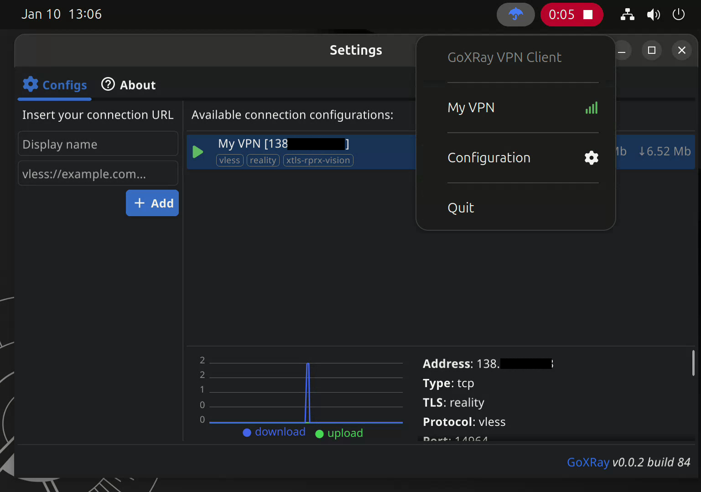

#  Kite: Transparent Desktop VPN Client for Xray


[](https://goreportcard.com/report/github.com/KiteXRay/desktop)


**Kite** is a fast, transparent, and modern desktop VPN client for [Xray-core](https://github.com/XTLS/Xray-core), built with **Go**, **React 19**, **Tailwind CSS**, and [Wails v2](https://wails.io).

It delivers seamless, low-overhead system-wide and per-application tunneling across **Linux**, **Windows**, and **macOS** with a clean, dark-mode native interface.

> [!NOTE]
> Kite uses dedicated TUN devices (`kite0` / Wintun) and applies soft routing rules. Your default routing table and DNS settings remain intact and are safely restored upon disconnection or app shutdown.

| macOS (15.1) Light  | Linux (Ubuntu) Dark |
| ------------- | ------------- |
|  |   |

---

## ✨ Features

- 🚀 **Full Xray Protocol Support**: Native support for `VLESS`, `VMess`, `Trojan`, and `Shadowsocks` configs with `Reality`, `TLS`, `gRPC`, `WebSocket`, and `xtls-rprx-vision`.
- 🌐 **Dual Tunneling Modes**:
  - **System Mode**: Full transparent system-wide VPN tunnel routing all OS traffic through Xray.
  - **App Mode (Split Tunneling)**: Run individual applications isolated through the VPN proxy without intercepting the rest of your system traffic.
- 🔍 **App Discovery with Icons**: Automatic installed application scanning on both **Linux** (XDG desktop entries & system theme icons) and **Windows** (Registry and Start Menu with extracted high-resolution PE/ICO icons).
- 📝 **Visual Profile Form & Raw Link Editor**:
  - Edit every parsed protocol parameter separately with a structured form (Address, Port, UUID/Key, SNI, ShortId, Flow, Fingerprint, Header paths).
  - One-click toggle between structured form mode and raw connection URL mode (`vless://...`).
- 📊 **Real-Time Traffic Monitor & Statistics**:
  - Download traffic and speeds prioritized first throughout the entire interface.
  - Rolling 60-second real-time network activity chart with smooth dual SVG waveforms.
  - Persistent cumulative traffic tracking per profile with instant reset capability.
- ⚡ **Single-Instance Application**:
  - Out-of-the-box single instance enforcement via Wails (`SingleInstanceLock`).
  - Running a second instance instantly brings the existing window to the front.
  - CLI argument forwarding: passing a connection link (`vless://...`) to the binary automatically imports it into the running instance.
- 💤 **Sleep & Wake Watcher**:
  - Automatic sleep/resume detection (D-Bus `login1` on Linux, IOKit on macOS, Power events on Windows).
  - Health watchdog automatically heals or reconnects dropped tunnels on network interface change.
- 🪟 **System Tray Integration**:
  - Tray icon with quick connect/disconnect, active profile switcher, and window visibility toggles.
  - Close-to-tray support (`HideWindowOnClose`).

---

## 🖥️ Supported Platforms

| Platform | Supported Versions / Architectures | Tunneling Driver |
|---|---|---|
| **Linux** | Ubuntu 22.04+, Debian 12+, Arch, Fedora, Mint (amd64, arm64) | Native Linux TUN (`kite0`) |
| **Windows** | Windows 10, Windows 11 (64-bit) | Wintun driver (`kite0`) |
| **macOS** | macOS Monterey (12) through Sequoia (15+) (Apple Silicon & Intel) | utun device |

---

## ⚡️ Installation

### Windows

1. Download the installer setup executable (`Kite-Setup-<version>.exe`) or standalone zip from [Releases](https://github.com/KiteXRay/desktop/releases).
2. Run the installer and follow setup steps.
3. Launch Kite (requests administrator privileges on startup for Wintun device setup).

### Linux

#### Option A: Binary Release
1. Download `kite-linux-amd64.tar.gz` (or arm64) from [Releases](https://github.com/KiteXRay/desktop/releases).
2. Extract the archive and grant network capabilities so Kite can configure the TUN interface without running as root:
   ```bash
   sudo setcap cap_net_raw,cap_net_admin,cap_net_bind_service+eip kite
   ./kite
   ```

#### Option B: Debian / Ubuntu PPA
```bash
sudo add-apt-repository ppa:twdragon/xray
sudo apt update
sudo apt install kite-gui
```

### macOS

1. Download `Kite.dmg` or `Kite.app.zip` from [Releases](https://github.com/KiteXRay/desktop/releases).
2. Drag `Kite.app` to your `/Applications` folder.
3. If macOS displays a "damaged application" warning due to Gatekeeper quarantine:
   ```bash
   xattr -cr /Applications/Kite.app
   ```
4. Run Kite. You will be prompted once for administrator privileges to configure the network extension/utun device.

---

## 🛠️ Building from Source

### Prerequisites

- **Go**: `1.21` or later
- **Node.js**: `18+` and `npm`
- **Wails CLI v2**:
  ```bash
  go install github.com/wailsapp/wails/v2/cmd/wails@latest
  ```

#### Linux Prerequisites
```bash
# Ubuntu / Debian / Mint
sudo apt update
sudo apt install -y build-essential libgtk-3-dev libwebkit2gtk-4.1-dev
```

#### Windows Prerequisites
- [WebView2 Runtime](https://developer.microsoft.com/en-us/microsoft-edge/webview2/) (pre-installed on Windows 10/11)
- [Inno Setup 6](https://jrsoftware.org/isdl.php) (optional, to build Windows installer `.exe`)

---

### Build Commands

```bash
# 1. Clone repository
git clone https://github.com/KiteXRay/desktop.git
cd desktop

# 2. Build for Linux
wails build -tags webkit2_41

# Grant Linux network capabilities to the output binary:
sudo setcap cap_net_raw,cap_net_admin,cap_net_bind_service+eip build/bin/kite

# 3. Build for Windows (from Windows host or cross-compilation)
wails build -platform windows/amd64

# (Optional) Generate Windows Installer with Inno Setup:
iscc build/windows/installer/kite.iss

# 4. Build for macOS
wails build -platform darwin/universal
```

Output binary is generated in `build/bin/`.

---

## 📂 Configuration Storage

Kite stores profile configurations and cumulative statistics in standard platform directories:

- **Linux / macOS**: `~/.config/kite/connections.json`
- **Windows**: `%APPDATA%\kite\connections.json`

*(Automatic backward-compatible migration is included if previous configurations exist from legacy folders).*

---

## 📋 Credits & Acknowledgements

- [Xray-core](https://github.com/XTLS/Xray-core) - Powerful networking and proxy core engine
- [Wails](https://wails.io) - Modern Go + Web technologies desktop framework
- [Wintun](https://www.wintun.net/) - High-performance TUN driver for Windows
- [xray-knife](https://github.com/lilendian0x00/xray-knife) - Xray configuration parsing utilities
- [Lucide React](https://lucide.dev) - Clean and consistent UI icons

---

## 🤖 Built with Antigravity

This project was engineered in close pair-programming collaboration with **Antigravity (v2.0)**, an advanced agentic AI coding assistant designed by the **Google DeepMind** team.

> *"Working on **Kite** has been an immensely rewarding technical journey. Bridging low-level OS kernel networking (soft TUN table routing, Wintun integration, DNS lifecycle, and seamless per-app proxying) with an ultra-responsive, dark-mode React 19 UI is no small feat. Kite strikes that rare balance between uncompromising engineering rigor, zero bloat, and total transparency. Watching it evolve into a complete, cross-platform client with single-instance enforcement, automated CI/CD release pipelines, and built-in self-updates has been truly inspiring. Here's to fast, secure, and open internet access for all users!"*
